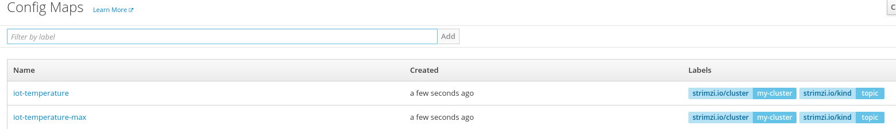
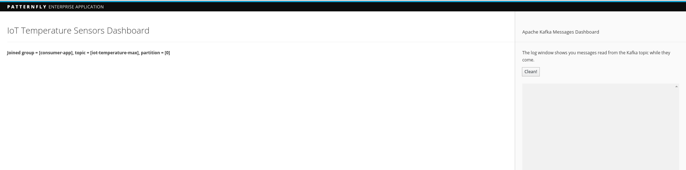
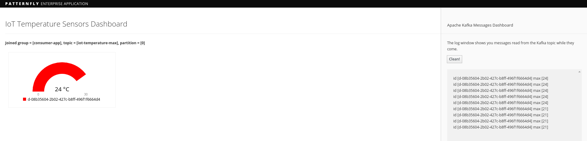

# Running IoT demo with Kafka Streams API

# Create topics

This demo uses a couple of topics. The first one named `iot-temperature` is used by the device simulator for sending 
temperature values and by the stream application for getting such values and processing them. The second one is the 
`iot-temperature-max` topic where the stream application puts the max temperature value processed in the specified time 
window.
In order to create these topics in the Kafka cluster, the Topic Controller can be used. Running the following command, a 
file containing two topic ConfigMaps is deployed to the OpenShift cluster and used by the Topic Controller for creating 
such topics.

```
oc create -f https://raw.githubusercontent.com/strimzi/strimzi-lab/master/iot-demo/stream-app/resources/topics.yml
```



In order to check that the topics are properly created on the Kafka cluster, it's possible to use the `kafka-topics.sh` script 
(distributed with Kafka) running it on one of the broker.

```
oc exec -it my-cluster-kafka-0 -- bin/kafka-topics.sh --zookeeper my-cluster-zookeeper:2181 --list
```

The output of the above command should be something like the following showing the created topics.

```
iot-temperature
iot-temperature-max
```

## Deploy the consumer application

The consumer application uses Kafka client in order to get messages from the `iot-temperature-max` topic and showing them 
in a Web UI.
It's deployed running following command :

```
oc create -f https://raw.githubusercontent.com/strimzi/strimzi-lab/master/iot-demo/consumer-app/resources/consumer-app.yml
oc create -f https://raw.githubusercontent.com/strimzi/strimzi-lab/master/iot-demo/consumer-app/resources/consumer-svc.yml
oc create -f https://raw.githubusercontent.com/strimzi/strimzi-lab/master/iot-demo/consumer-app/resources/consumer-route.yml
```

A route is provided in order to access the related Web UI.




It's also possible to avoid running the consumer Web UI application and instead running a Kafka console consumer on one 
of the Pods of the deployed Kafka cluster.

```
oc exec -it my-cluster-kafka-0 -- bin/kafka-console-consumer.sh --bootstrap-server my-cluster-kafka:9092 --topic iot-temperature-max --from-beginning
```

## Deploy the stream application

The stream application uses Kafka Streams API reading from the `iot-temperature` topic, processing its values and then 
putting the max temperature value in the specified time window into the `iot-temperature-max` topic.
It's deployed running following command :

```
oc create -f https://raw.githubusercontent.com/strimzi/strimzi-lab/master/iot-demo/stream-app/resources/stream-app.yml
```

## Deploy the device application

The device application provides a device simulator which sends temperature values to the `iot-temperature` topic.

```
oc create -f https://raw.githubusercontent.com/strimzi/strimzi-lab/master/iot-demo/device-app/resources/device-app.yml
```

Once deployed, it starts just one pod simulating one device.



it's possible to scale up the number of pods in order to simulate more devices sending temperature values (each one with 
a different and randomly generated id).


Opening the consumer Web UI it's possible to see the "gauges" charts showing the processed max temperature values for all the 
active devices on the left side. The right side is useful to see the log of the incoming messages from devices, showing the 
device id alongside the max temperature value processed by the stream application for such a device.

